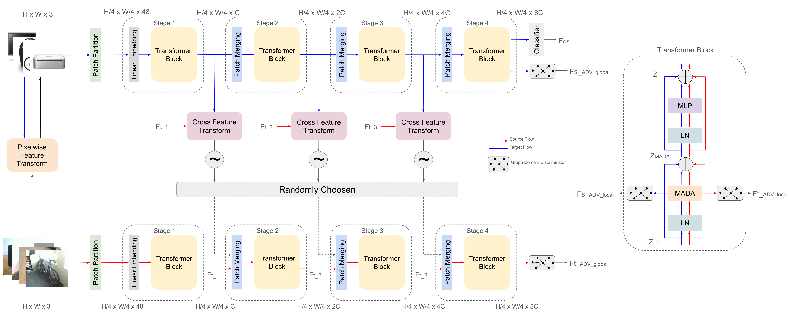

# TransAdapter: Vision Transformer for Feature-Centric Unsupervised Domain Adaptation

Official PyTorch implementation of [**TransAdapter: Vision Transformer for Feature-Centric Unsupervised Domain Adaptation**](https://arxiv.org/abs/2412.04073).

[](https://github.com/enesdoruk/TransAdapter)


**Authors:** [Abdullah Enes Doruk](www.linkedin.com/in/enesdrk), [Erhan Oztop](https://www.linkedin.com/in/erhan-oztop-804a27152/), and [Hasan F. Ates](https://www.linkedin.com/in/hasan-f-ates-9a5b6812/)


Our Vision Transformer for Feature-Centric Unsupervised Domain Adaptation.

<p align="center">

</p>

## Abstract
Unsupervised Domain Adaptation (UDA) aims to utilize labeled data from a source domain to solve tasks in an unlabeled target domain, often hindered by significant domain gaps. Traditional CNN-based methods struggle to fully capture complex domain relationships, motivating the shift to vision transformers like the Swin Transformer, which excel in modeling both local and global dependencies. In this work, we propose a novel UDA approach leveraging the Swin Transformer with three key modules. A Graph Domain Discriminator enhances domain alignment by capturing inter-pixel correlations through graph convolutions and entropy-based attention differentiation. An Adaptive Double Attention module combines Windows and Shifted Windows attention with dynamic reweighting to align long-range and local features effectively. Finally, a Cross-Feature Transform modifies Swin Transformer blocks to improve generalization across domains. Extensive benchmarks confirm the state-of-the-art performance of our versatile method, which requires no task-specific alignment modules, establishing its adaptability to diverse applications.

## Installation (Python 3.8.19)

This project tested under pytorch 2.4.1 and CUDA 12.4 versions. However, you can work with CUDA 11x and related Pytorch versions. 

**a.** Create environment
```Shell
conda env create -f environment.yml
```

**b.** Activate environment
```Shell
conda activate dom
```

Install fused window process for acceleration, activated by passing --fused_window_process in the running script

```Shell
cd kernels/window_process
python setup.py install #--user
```

## Pretrained Swin
Download the following models and put them in checkpoints/

* Swin-B [(ImageNet)](https://github.com/SwinTransformer/storage/releases/download/v1.0.0/swin_base_patch4_window7_224_22k.pth)


## Datasets
- Download [data](https://drive.google.com/file/d/1rnU49vEEdtc3EYVo7QydWzxcSuYqZbUB/view?usp=sharing) and replace the current `data/`

- Download images from [Office-31](https://drive.google.com/file/d/0B4IapRTv9pJ1WGZVd1VDMmhwdlE/view?resourcekey=0-gNMHVtZfRAyO_t2_WrOunA), [Office-Home](https://drive.google.com/file/d/0B81rNlvomiwed0V1YUxQdC1uOTg/view?resourcekey=0-2SNWq0CDAuWOBRRBL7ZZsw), [VisDA-2017](https://github.com/VisionLearningGroup/taskcv-2017-public/tree/master/classification) and put them under `data/`. For example, images of `Office-31` should be located at `data/office/domain_adaptation_images/`

## Training Baseline (For Pseudo Label Creation)
Command can be found training bash file  `scripts/training_swin.sh`.

```
python train_swin.py --train_batch_size 64 --dataset office \
        --source_list data/office/webcam_list.txt \ 
        --target_list data/office/amazon_list.txt \
        --test_list_source data/office/webcam_list.txt \
        --test_list_target data/office/amazon_list.txt \
        --pretrained_dir checkpoint/swin_base_patch4_window7_224_22k.pth \ 
        --num_steps 5000 --num_classes 31 
```

## Training TransAdapter
Command can be found training bash file  `scripts/training_transadapter.sh`.
If you do not want to train baseline model, you can set ```--pseudo_lab False```

```
python train_transadapter.py --train_batch_size 64 --dataset office \
        --source_list data/office/webcam_list.txt \ 
        --target_list data/office/amazon_list.txt \
        --test_list_source data/office/webcam_list.txt \
        --test_list_target data/office/amazon_list.txt \
        --num_classes 31 \
        --pretrained_dir checkpoint/swin_base_patch4_window7_224_22k.pth \ 
        --num_steps 15000 --gamma 0.1 --beta 0.01 -thata 0.0001 \
        --pseudo_lab True 
```

## Acknowledgement
- We thank the authors of [TVT](https://github.com/uta-smile/TVT/tree/main) and [Swin-Transformer](https://github.com/microsoft/Swin-Transformer/tree/main) and  their open-source codes.

## Citation
```
@article{doruk2024transadapter,
  title={TransAdapter: Vision Transformer for Feature-Centric Unsupervised Domain Adaptation},
  author={Doruk, A and Oztop, Erhan and Ates, Hasan F},
  journal={arXiv preprint arXiv:2412.04073},
  year={2024}
}
```
